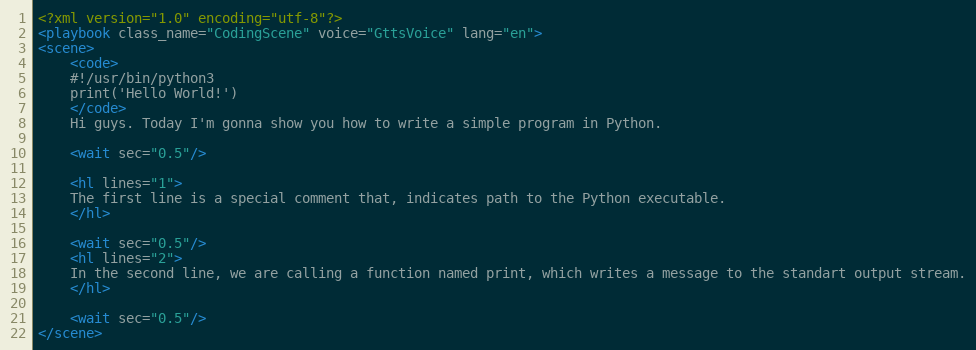

# VideoMachine

Generate videos from simple XML playbooks.


This project uses moviepy module. This is a work in progress. Intended to be an extensible library/framework-like thing. 
Now only generates silly TTS coding tutorials.
Example output: [](https://youtu.be/VKi5sNB40yA)


## Installation

```
git clone https://github.com/overengineer/VideoMachine.git
cd VideoMachine
pip3 install -r requirements.txt
```

## Dependencies

You should have installed one of TTS tools below to generate TTS tracks. 
- flite
- espeak-ng
- gTTS

Alternatively, you can write TTS wrapper for other TTS engines/APIs. See [extending](#extending).

## Usage

```
python3 main.py path/to/playbook.xml
```

## Playbook Syntax

`playbook`s consist of scenes. `scene`s contains actions (e.g. `<code>` tag for code snippets). `class_name` of scenes can be placed as `class_name` attribute either in each scenes or playbook for default class. `class_name` attribute should match name of `render.Scene` subclass. 'w', 'h' attributes represent width and height of the video.

### Sytnax for `CodingScene` class scenes

For determining which TTS engine to use, you should add `voice` attribute matching name of `voice.tts.Voice` subclass. This may be set globally by placing in `<playbook>` tag.

`<code>` tag may have attribute `lang` which represents alias for pygments 

Text elements inside `scene` tags are wrapped with `tts` tags on rendering phase. You can either write TTS scripts as text element of inside `tts` tags. 

`hl` tags causes renderer to render snippet with certain lines highlighted, then call TTS engine.

`wait` tags inserts silence for given seconds.

## Extending

Extend `render.Scene` class for new types of Scenes. 
New tag handler method names should match corresponding tag name.

New voice subclasses should inherit `voice.tts.Voice` class and should implement `say(self, txt)` method.

